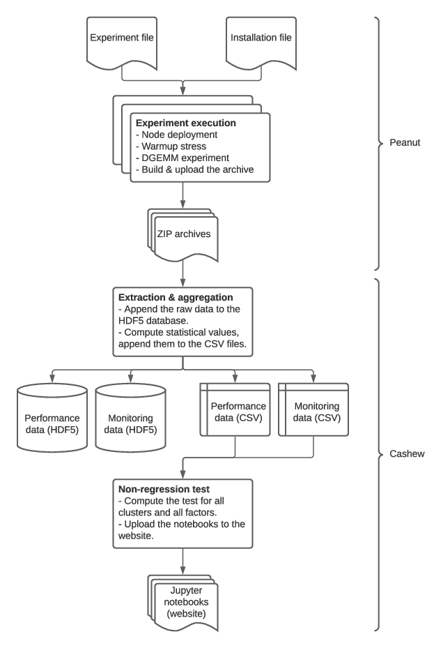

[](https://doi.org/10.5281/zenodo.4625737)

This Python library is intended to work on [peanut](https://github.com/Ezibenroc/peanut/) archives. One of the main use
cases is to run performance non-regression tests.

For non-regression tests, the workflow is the following:


A simple way to achieve this is to run the following command on Grid'5000, it
will submit a job that install the required dependencies using the
[install_CI.sh](install_CI.sh) script, then run the script [CI.sh](CI.sh) for
extracting data and meta-data from the archives and aggregating this data,
finally run the script [CI_test.sh](CI_test.sh) for computing the
non-regression tests and generating the notebooks.

```sh
oarsub -l "walltime=01:00:00" -n "CI" "curl https://raw.githubusercontent.com/Ezibenroc/cashew/master/install_CI.sh | bash && bash /CI.sh && bash /CI_test.sh"
```

All these scripts are using the `cashew` command line utility, which can be
installed with `pip` as usual. There exists three main cashew commands,
illustrated below.

The following command extract the "monitoring" data from the given zip archive
and add this data to the HDF5 file `data.db` (note: replace "monitoring" by
"performance" for extracting the performance data). If the file does not exist,
it will be created, otherwise the data is appended without deleting any
existing data. The last options are used to select the desired compression
algorithm.
```sh
cashew extract lille_2021-03-01_1795916.zip monitoring data.db  --compression zlib --compression_lvl 9 --format table
```

The following command read the (raw) data from the HDF5 file `data.db`, compute
the aggregated data (either averages or linear regressions, depending on the
kind of data), then store the result in the file `stats.csv`. If the file
`stats.csv` already exists, then cashew will only load the experiments of
`data.db` that were done after the last experiment of `stats.csv`. This allows
to not recompute everything from scratch at each new experiment.
```sh
cashew stats data.db stats.csv
```

The following command performs statistical tests for the three given clusters
and generate the notebooks in the given directory. It is possible to perform
tests for all the available clusters by replacing the cluster names by "all".
```sh
cashew test --output /tmp/notebooks dahu troll yeti
```
